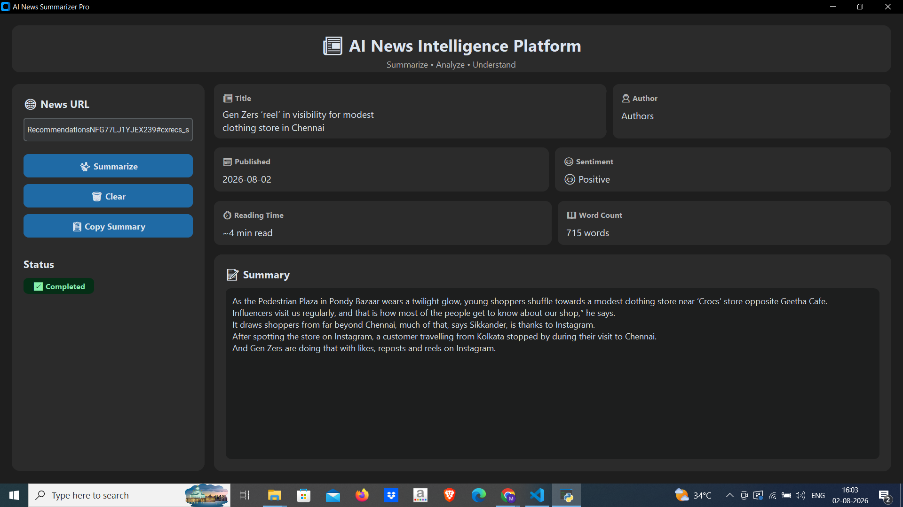

# 📰 AI News Intelligence Platform

A modern desktop application that automatically extracts, summarizes, and analyzes news articles using Natural Language Processing (NLP).

---

## 📸 Application Preview

## 📸 Application Preview



---

## ✨ Features

- 📰 Automatic News Article Extraction
- 🧠 AI-based News Summarization
- 😊 Sentiment Analysis
- 👤 Author Detection
- 📅 Publication Date
- ⏱ Reading Time Estimation
- 📖 Word Count
- 📋 Copy Summary
- 🎨 Modern Dark UI

---

## 🛠 Tech Stack

- Python
- CustomTkinter
- Newspaper3k
- Trafilatura
- BeautifulSoup4
- NLTK
- TextBlob
- Requests

---

## 📂 Project Structure

```
AI-News-Intelligence-Platform/
│
├── assets/
├── core/
├── ui/
├── app.py
├── requirements.txt
└── README.md
```

---

## 🚀 Installation

Clone the repository

```bash
git clone <repository-url>
```

Create a virtual environment

```bash
python -m venv venv
```

Activate the virtual environment

Windows

```bash
venv\Scripts\activate
```

Install dependencies

```bash
pip install -r requirements.txt
```

Run the application

```bash
python app.py
```

---

## 📌 Current Features

- Modern desktop dashboard
- Automatic article extraction
- NLP summarization
- Sentiment detection
- Reading time estimation
- Word count
- Copy summary

---

## 🚀 Upcoming Features

- 🤖 Gemini AI Summaries
- 📄 Export Summary as PDF
- 💬 Chat with News
- 🌍 Multi-language Support
- 📰 Article Image Preview
- 📚 Multiple Summary Modes

---

## 👨‍💻 Author

Developed by **Harshini**

---

## ⭐ Support

If you like this project, consider giving it a ⭐ on GitHub.